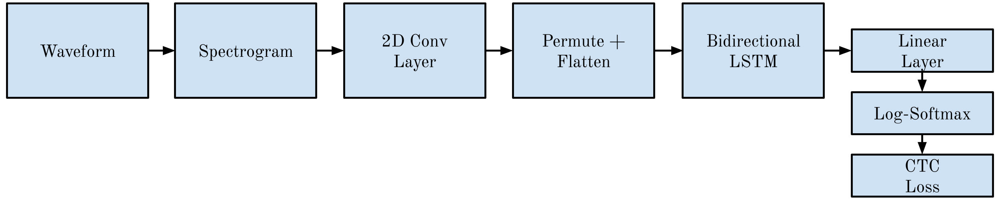
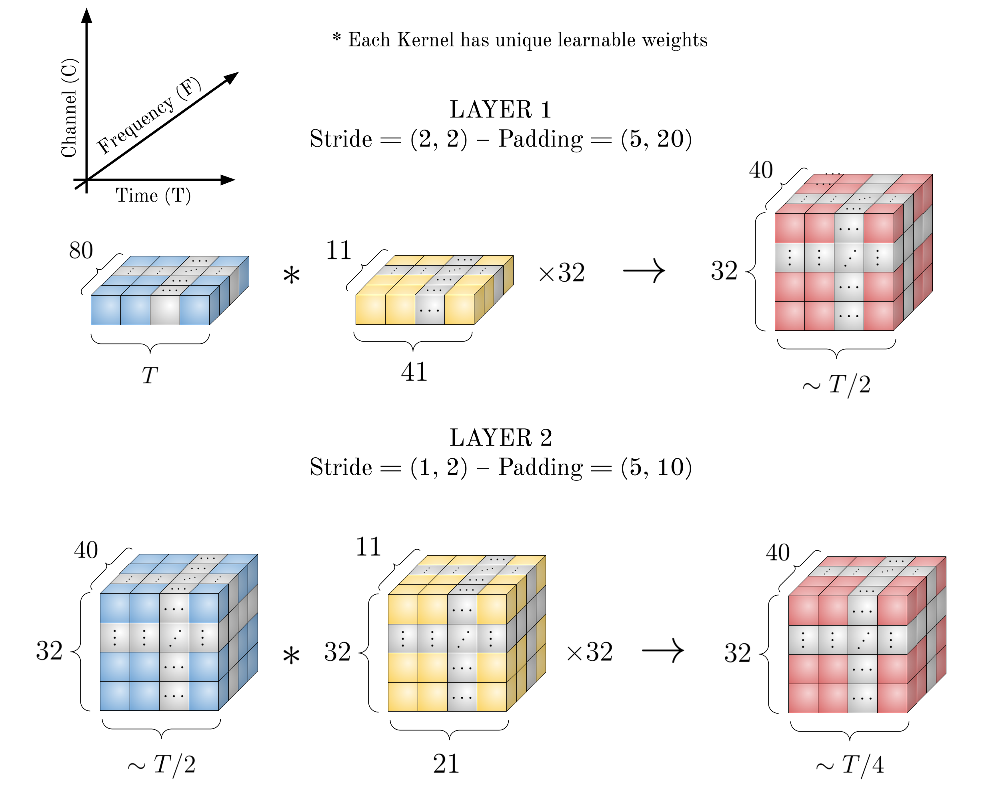
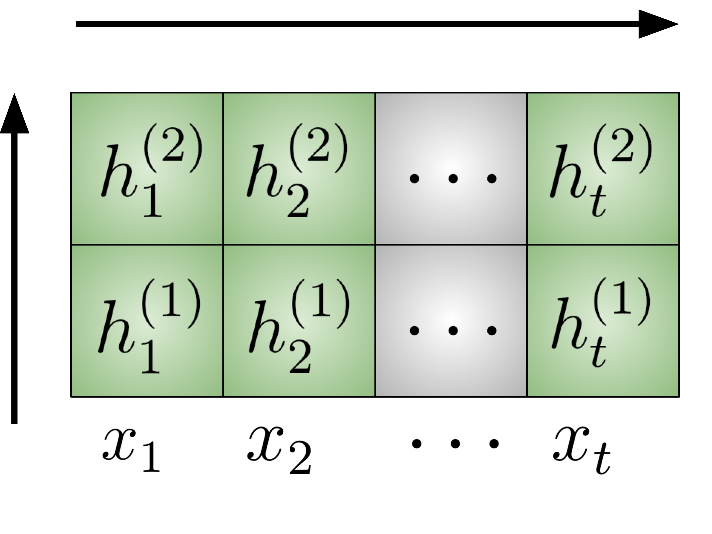
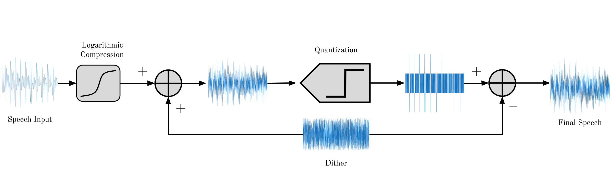

# Toy ASR

**Ellison Murray**

## Introduction

This document covers two related pieces of work built around a toy Automatic Speech Recognition (ASR) model. First, it provides a step-by-step walkthrough of the model: through layer-by-layer visual diagrams and structural descriptions, it details how audio data is transformed and propagated through the network to generate text predictions, serving as an accessible conceptual introduction for readers new to ASR or machine learning in general. Second, it uses that same model as a testbed for an evaluation sweep over audio preprocessing choices, scalar quantizer bitdepth, dithering, and mu-law companding, to study how each affects recognition accuracy.

*Figure 1: Block Diagram of Toy ASR Model*

## Dataset

This project uses single English speech commands from the [Google Speech Commands Dataset](https://arxiv.org/abs/1804.03209). Audio is processed as 16-bit PCM at 16 kHz.

## Model

### Front End

The input audio is represented as a $T \times 80$ tensor corresponding to log-mel spectrogram features across 80 frequency channels.

*Figure 2: Structural Tensor Mechanics of the Model 2 Front-End.*

We permute the second layer's output:

$$
(\text{Batch}, \text{Channel}, \text{Frequency}, \text{Time}) \rightarrow (\text{Batch}, \text{Time}, \text{Channel}, \text{Frequency})
$$

Then we reshape:

$$
(\text{Batch}, \text{Time}, \text{Channel}, \text{Frequency}) \rightarrow (\text{Batch}, \text{Time}, \text{Channel} \times \text{Frequency})
$$

### Bidirectional Long Short-Term Memory Model

The dimension of the hidden state $h_t$ is 128.

Refer to [Introduction to Long Short-Term Memory](https://www.geeksforgeeks.org/deep-learning/deep-learning-introduction-to-long-short-term-memory/) for a more in-depth explanation of this architecture.

Our model considers a two-layer LSTM architecture. The equations below provide a crude simplification of the model, given a recurrent function $f(\cdot)$:

$$
h_t^{(1)} = f(x_t, h_{t-1}^{(1)})
$$

$$
h_t^{(2)} = f(h_t^{(1)}, h_{t-1}^{(2)})
$$

*Figure 3: 2-Layer LSTM Structural Mapping*

Because we use a bidirectional LSTM, for each time step $t$ the hidden state dimension doubles, combining the forward and backward passes:

$$
(\text{Batch}, \text{Time}, 2 \times \text{hiddendim}) \rightarrow (\text{Batch}, \text{Time}, \text{vocabsize})
$$

Before performing CTC loss, we pass our sequence of hidden states through a linear layer to project to the vocabulary dimension. This tensor is then passed through a Log-Softmax function, converting it into a PMF—the discrete probabilities of each character occurring at time step $t$.

### Connectionist Temporal Classification

When performing CTC loss, we have a known target, and because the actual output sequence is often longer than the target sequence, repeats and spaces can exist. CTC introduces a blank character $\epsilon$.

Refer to [Connectionist Temporal Classification](https://www.geeksforgeeks.org/nlp/connectionist-temporal-classification/) for a better explanation of how this handles repeated characters via collapsing.

The CTC loss is defined as:

$$
\mathcal{L} = -\log P(Y = \text{Target} \mid X)
$$

Given the input sequence with character PMFs, CTC evaluates the probability of the target string occurring. The higher the probability, the smaller the loss, allowing the model to learn.

CTC computes this by considering all valid alignments of the target within the output sequence length. Let $\pi$ denote an alignment and $\mathcal{A}(\text{Target})$ denote the set of valid alignments:

$$
P(Y = \text{Target} \mid X) = \sum_{\pi \in \mathcal{A}(\text{Target})} P(\pi \mid X)
$$

Because we have the PMF at each time step within the sequence, CTC can directly compute $P(\pi \mid X)$.

Each input vector $x_t$, for an all-lowercase alphabet plus the blank token, has length $26 + 1 = 27$:

$$
x_t = [p_a, p_b, \dots, p_z, p_{\epsilon}]^T
$$

where

$$
\lVert x_t \rVert_1 = 1
$$

### Example

Suppose:

$$
\text{Target} = \text{abc}
$$

For an output sequence of length four, valid alignments include:

$$
ab\epsilon c
$$

and

$$
\epsilon abc
$$

Let:

$$
\pi = ab\epsilon c
$$

Then:

$$
\begin{aligned}
P(\pi \mid X) &= P(y_1 = a \mid x_1) \, P(y_2 = b \mid x_2) \\
&\quad \times P(y_3 = \epsilon \mid x_3) \, P(y_4 = c \mid x_4)
\end{aligned}
$$

### Evaluation

Using this toy model we apply various preprocessing techniques in conjunction with scalar quantization, to evaluate their impact on ASR performance. We consider mu-law companding and dithering. A block diagram of our tested system is shown below. Specifically, we switch the dithering and mu-law companding blocks on and off, and sweep the quantizer bitdepth from 1 to 6, giving a $6 \times 2 \times 2 = 24$-point sweep, each point trained as its own model (`run_all.py`, driving `train.py`).

*Figure 4: Block Diagram of the Dithered Quantizer.*

Dithering, when enabled, is subtractive: a triangular dither is added before quantization and subtracted from the quantized signal afterward. When mu-law companding is also enabled, we intentionally do **not** apply the inverse (expansion) step after the dither is subtracted -- the signal is left companded. This is a deliberate choice for this sweep, not an oversight.

Each run's results (per-epoch WER/CER, WER-vs-epoch plot, model weights) are written to a directory named after its exact setting, e.g. `results/3bit_ditherOn_mulawOff/`. After the full sweep, `plot_sweep.py` summarizes minimum WER vs bitdepth, one line per dither/mulaw setting; CER is still recorded in each run's CSV but is left out of the plots.

### Discussion

The sweep results show the expected trend within each condition: increasing the scalar quantizer's bitdepth decreases WER. Dithering, on the other hand, never provides a clear benefit: when mu-law compression is off, dithered runs are occasionally on par with their non-dithered counterparts but are just as often worse, and when mu-law is on there is no significant difference between dithering and no dithering. Mu-law compression itself only helps at low bitdepths (notably 2 bits), where it gives a small improvement over compression being off; at higher bitdepths, compression off is consistently better.

Only the 6-bit, compression-off condition gets close to the lower-bound WER set by the Whisper base model we evaluated against. So under the conditions tested, bitdepth is by far the most impactful variable for a scalar quantizer. That said, at low rates, specifically 2 bits, shaping the input distribution to better use the quantizer's dynamic range (i.e., matching it to the Laplacian-like amplitude distribution of speech) is measurably beneficial.

It's still an open question why compression prevents the model from converging closer to the Whisper lower bound at higher bitdepths. It doesn't seem to be an interaction between dithering and compression, since dithering on vs. off makes little difference either way. A plausible explanation is that the logarithmic compression curve distorts the amplitude mapping in a way that damages harmonic structure the model relies on, but this hasn't been verified. Future work would look into:

- Why compression underperforms at higher bitdepths specifically, and whether at large numbers of quantization levels the compression curve causes the opposite problem: collisions/clipping in the compressed amplitude range for Laplacian-distributed speech.
- Training a full-scale ASR model on this sweep rather than the toy model here.
- A mechanistic-interpretability pass on the trained models to better understand what's actually happening internally under each condition.